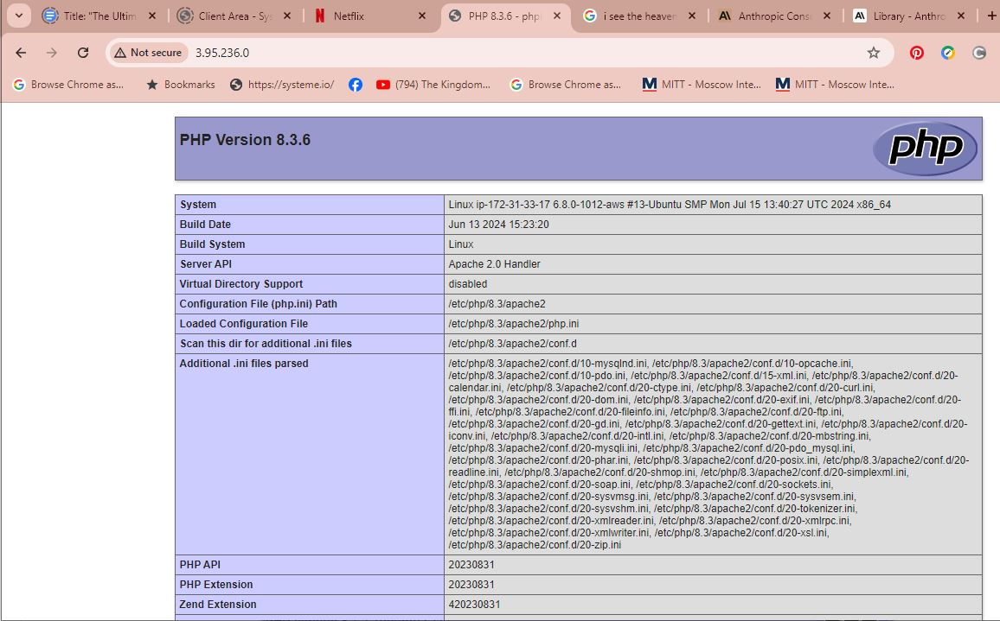

# Introduction

In this fourth project, the task is on setting up a WordPress website using the LAMP stack. This task provided me with the basic skills to finally be able to deploy a WordPress platform.

## System software Used

- Linux: As the operating system, Linux provided a stable and secure environment for running the other components.

- Apache: Served as the web server, handling requests and delivering web content.

- MySQL: Acted as the database, storing all WordPress data including content, user information, and settings.

- PHP: As the scripting language driving the WordPress engine.

## Step 1: Deploying an Ubuntu Server

The first step was to set up an Ubuntu server on AWS EC2 for the LAMP stack.

- Task: Successfully Deployed an Ubuntu server on AWS EC2.

- Step 2: Installing the LAMP Stack

Next, I installed the LAMP components on the server as follows:

1. Apache Installation using the following codes:

A. sudo apt update

B. sudo apt install apache2

C. sudo systemctl start apache2

2. MySQL Installation using the following codes:

A. sudo apt install mysql-server
B. sudo mysql_secure_installation

3. PHP Installation using the following codes:

sudo apt install php libapache2-mod-php php-mysql

I successfully installed and configure LAMP stack, Apache, MySQL, and PHP

## Step 3: Download and Configuring WordPress 

I used the following codes: 

A. cd /var/www/html
B. sudo wget http://wordpress.org/latest.tar.gz
C. sudo tar -xvzf latest.tar.gz

1. Database Configuration for WordPress:

I used the following codes:

A. sudo mysql -u root -p
B. CREATE DATABASE wp_db;
C. GRANT ALL PRIVILEGES ON wordpress_db.* TO david@localhost IDENTIFIED BY 'password';
D. FLUSH PRIVILEGES;

I successfully Configured WordPress with a dedicated MySQL database.

## Step 4: DNS Configuration and Mapping

For public accessibility, I mapped the IP address to the DNS A record as follows:

Using Route 53 Setup: I Added an A record for the server’s IP to link the domain to the WordPress site and successfully Update DNS settings to point to the new WordPress site.

## Step 5: Securing the Website with SSL/TLS

To enhance security, I installed SSL certificates using Certbot as follows:

A. sudo apt-get install certbot python3-certbot-apache
B. sudo certbot --apache -d ettours.com.ng -d www.ettours.com.ng

SSL/TLS certificates installed and site secured with HTTPS.

## Conclusion

Now I have the basic understanding of deploying WordPress with a LAMP stack.